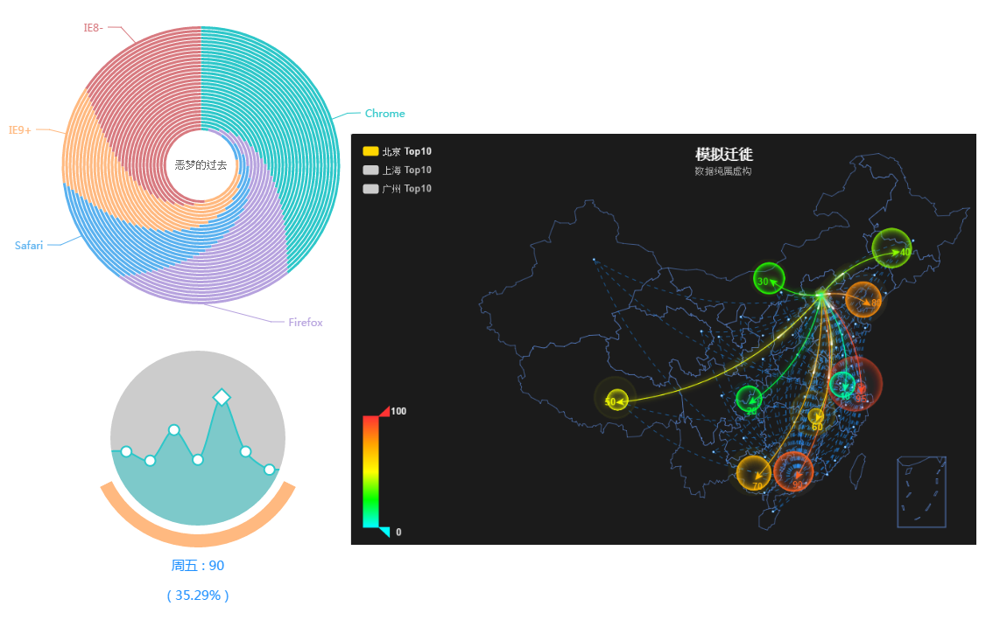

## Echart
```{r,echo=FALSE,message=FALSE}
library(recharts)
library(quantmod)
library(xtable)


# Pie

x=data.frame(name=c("飲食",  "衣物",  "住家",  "醫療",  '交通',		"娛樂",	'教育'),value=c(22,10,30,40,25,10,10))

load('stock.RData')

```
- 作者：林峰
- <a href='http://echarts.baidu.com/index.html'>http://echarts.baidu.com/index.html</a>
- JaveScript
- 小工具
- 可以任意混搭


## recharts

- 作者：魏太云 周揚
- <a href='https://github.com/taiyun/recharts'>https://github.com/taiyun/recharts</a>
- R皮J骨
- data.frame or matrix


## recharts (second version)

- 作者：謝益輝
- <a href='https://github.com/yihui/recharts'>https://github.com/yihui/recharts</a>
- base on package-`htmlwidgets`
- My version: <a href='https://github.com/KuiMing/recharts'>https://github.com/KuiMing/recharts</a>

## Drag to Combine

```{r, results='asis'}
echart(x,~name,~value,type='pie')
```

## Zoom in 

```{r, results='asis',echo=TRUE,message=FALSE}
echart(iris, ~Sepal.Length, ~Sepal.Width)
```

## Choose Data Range 

```{r, results='asis',echo=TRUE,message=FALSE}

ecandlestick(TWII)
```

## Draw Auxiliary Lines
```{r, results='asis',echo=TRUE,message=FALSE}
echart(pressure,~temperature,~pressure,type='line')
```

## Switch Chart types
```{r, results='asis',echo=FALSE,message=FALSE}
bar_df = data.frame(date = rep(paste("day", 1:10), 2), temperature = floor(rnorm(n = 20, 
    mean = 20, sd = 10)), location = rep(c("NY", "DC"), each = 10))
echart(bar_df, ~date, ~temperature, ~location)
```

## Switch Chart types
```{r, results='asis',echo=FALSE,message=FALSE}
echart(x,~name,~value,type='pie')
```

## Switch Chart types
```{r, results='asis',echo=FALSE,message=FALSE}
chordEx1 = list(
  title = list(
    text = 'test',
    subtext = 'From d3.js',
    x = 'right',
    y = 'bottom'
  ),
  tooltip = list(
    trigger = 'item',
    formatter = JS('function(params) {
                   if (params.indicator2) { // is edge
                   return params.value.weight;
                   } else {// is node
                   return params.name
                   }
                   }')
  ),
  toolbox = list(
    show = TRUE,
    feature = list(
      restore = list(show = TRUE),
      magicType = list(show = TRUE, type = c('force', 'chord')),
      saveAsImage = list(show = TRUE)
    )
  ),
  legend = list(
    x = 'left',
    data = c('Korea', 'Japan', 'China', 'Taiwan')
  ),
  series = list(
    list(
      type = 'chord',
      sort = 'ascending',
      sortSub = 'descending',
      showScale = TRUE,
      showScaleText = F,
      data = list(
        list(name = 'Korea'),
        list(name = 'Japan'),
        list(name = 'China'),
        list(name = 'Taiwan')
      ),
      itemStyle = list(
        normal = list(
          label = list(show = FALSE)
        )
      ),
      matrix = rbind(
        c(0,10,10,10),
        c( 10,0,20,50),
        c( 20,20,0,10),
        c( 10,50,10,0)
      )
    )
  )
    )

echart(chordEx1)
```

## 30% Completed...
```{r, results='asis',echo=FALSE,message=FALSE}
egauge(30)
```


## More Powerful function

- <a href='http://echarts.baidu.com/doc/example/mix12.html' width=800 height=500>Mix</a>、<a href='http://echarts.baidu.com/doc/example/lasagna.html' >Lasagna</a>、<a href='http://echarts.baidu.com/doc/example/map11.html'>Map</a>

</img>

# Coming soon

# Thank you!
